# DoctorAI System Architecture Documentation

## Overview

The DoctorAI system implements a modern, scalable microservices architecture designed for AI-powered medical diagnosis. The system integrates multiple specialized AI models with a responsive web interface, providing healthcare professionals with rapid, accurate medical image analysis and consultation capabilities.

## System Architecture Principles

### Design Philosophy
- **Microservices Architecture**: Loosely coupled, independently deployable services
- **API-First Design**: RESTful APIs with comprehensive documentation and versioning
- **Security by Design**: Multi-layered security with authentication, authorization, and audit logging
- **Scalability**: Horizontal scaling capabilities with load balancing and caching
- **Reliability**: Health monitoring, automatic restart, and graceful error handling
- **Performance**: Sub-second response times with optimized AI model inference

### Architectural Patterns
- **Layered Architecture**: Clear separation between presentation, business logic, and data layers
- **Event-Driven Architecture**: Asynchronous processing for non-blocking operations
- **Repository Pattern**: Abstracted data access with caching and persistence
- **Factory Pattern**: Dynamic model loading and service instantiation
- **Observer Pattern**: Real-time monitoring and health checks

## High-Level System Architecture

### System Components Overview

```mermaid
graph TB
    subgraph "🖥️ Presentation Layer"
        A1["🌐 Web Browsers<br/>Chrome, Firefox, Safari"]
        A2["📱 Mobile Devices<br/>iOS, Android, PWA"]
        A3["🔧 API Clients<br/>Postman, curl, Apps"]
    end
    
    subgraph "⚛️ Frontend Layer"
        B1["🎨 User Interface<br/>Components, Responsive UI"]
        B2["🔄 State Management<br/>Redux Toolkit, RTK Query"]
        B3["🔗 API Integration<br/>Axios Client, Type Safety"]
    end
    
    subgraph "🛡️ API Gateway & Load Balancer"
        C1["⚡ Nginx/Traefik<br/>SSL, Load Balancing, CORS"]
    end
    
    subgraph "🖥️ Backend Services Layer"
        D1["📡 API Endpoints<br/>Image Analysis, Medical Chat"]
        D2["🔐 Authentication<br/>JWT Tokens, bcrypt"]
        D3["🤖 Model Manager<br/>Lazy Loading, Memory Mgmt"]
    end
    
    subgraph "🧠 AI/ML Processing Layer"
        E1["🫁 Lung/Colon<br/>DenseNet201, 85MB"]
        E2["🐒 Monkeypox<br/>Enhanced DenseNet, 92MB"]
        E3["🧠 Brain Tumor<br/>Custom CNN, 78MB"]
        E4["💬 Medical Chatbot<br/>araT5, 98MB PyTorch"]
        E5["📱 X-ray Analysis<br/>CNN, 65MB"]
        E6["🤚 Palm Disease<br/>XGBoost, 2MB"]
    end
    
    subgraph "💾 Data & Caching Layer"
        F1["🗃️ Session Storage<br/>JWT Validation"]
        F2["⚡ Prediction Cache<br/>Image Hash Keys, 1h TTL"]
        F3["⚙️ Configuration<br/>Feature Flags, Settings"]
    end
    
    subgraph "💿 Storage Layer"
        G1["📁 Model Storage<br/>.h5, .pkl Models"]
        G2["📊 Logs & Audit<br/>Security Events, API Logs"]
        G3["🔧 Configuration<br/>.env, Docker Configs"]
        G4["☁️ Azure Blob<br/>Cloud Backup, CDN"]
    end
    
    subgraph "🐳 Infrastructure & DevOps"
        H1["🐳 Docker Compose<br/>Service & Network Mgmt"]
        H2["❤️ Health Monitors<br/>Liveness & Readiness"]
        H3["🔄 Auto-restart<br/>Failure Recovery"]
        H4["📊 Monitoring<br/>Prometheus, Grafana"]
    end
    
    A1 --> B1
    A2 --> B1
    A3 --> D1
    B1 --> B2
    B2 --> B3
    B3 --> C1
    C1 --> D1
    D1 --> D2
    D2 --> D3
    D3 --> E1
    D3 --> E2
    D3 --> E3
    D3 --> E4
    D3 --> E5
    D3 --> E6
    D1 --> F1
    D1 --> F2
    D1 --> F3
    E1 --> G1
    E2 --> G1
    E3 --> G1
    D1 --> G2
    D2 --> G3
    G1 --> G4
    H1 --> D1
    H2 --> D1
    H3 --> D1
    H4 --> D1
    
    classDef presentation fill:#e3f2fd,stroke:#1976d2,stroke-width:2px
    classDef frontend fill:#61dafb,stroke:#21a1c4,stroke-width:2px
    classDef gateway fill:#fff3e0,stroke:#f57c00,stroke-width:2px
    classDef backend fill:#009688,stroke:#00695c,stroke-width:2px
    classDef ai fill:#ff9800,stroke:#e65100,stroke-width:2px
    classDef data fill:#dc382d,stroke:#a82c21,stroke-width:2px
    classDef storage fill:#4caf50,stroke:#388e3c,stroke-width:2px
    classDef devops fill:#9c27b0,stroke:#7b1fa2,stroke-width:2px
    
    class A1,A2,A3 presentation
    class B1,B2,B3 frontend
    class C1 gateway
    class D1,D2,D3 backend
    class E1,E2,E3,E4,E5,E6 ai
    class F1,F2,F3 data
    class G1,G2,G3,G4 storage
    class H1,H2,H3,H4 devops
```



### Service Dependencies


## Component Architecture Details

### Frontend Architecture (React Application)

#### Component Hierarchy
```
App.tsx (Root Component)
├── Router (React Router)
├── Redux Provider (State Management)
├── Error Boundary (Error Handling)
└── MainLayout (Primary Layout)
    ├── Header (Navigation)
    ├── Sidebar (Model Selection)
    ├── Main Content Area
    │   ├── Home Page
    │   ├── Diagnostics Page
    │   ├── Image Analysis Page
    │   ├── Chat Page
    │   ├── Dashboard Page
    │   └── Authentication Pages
    └── Footer (Information)
```

#### State Management Architecture
```typescript
// Redux Store Structure
interface RootState {
  auth: {
    user: User | null;
    token: string | null;
    isAuthenticated: boolean;
    loading: boolean;
  };
  diagnostics: {
    currentModel: string | null;
    predictions: Prediction[];
    uploadProgress: number;
    isAnalyzing: boolean;
  };
  ui: {
    sidebarOpen: boolean;
    notifications: Notification[];
    modals: ModalState;
    theme: Theme;
  };
  api: {
    // RTK Query cache and metadata
  };
}
```

#### API Integration Layer
```typescript
// Service Architecture
class ApiService {
  private baseURL: string;
  private httpClient: AxiosInstance;
  
  // Medical Image Analysis
  async predictLungColon(file: File): Promise<PredictionResult>
  async predictMonkeypox(file: File): Promise<PredictionResult>
  async predictTumor(file: File): Promise<PredictionResult>
  
  // System Services
  async healthCheck(): Promise<HealthStatus>
  async authenticate(credentials: LoginCredentials): Promise<AuthResult>
}
```

### Backend Architecture (FastAPI Server)

#### Service Layer Architecture
```python
# FastAPI Application Structure
class DoctorAIApp:
    def __init__(self):
        self.app = FastAPI()
        self.model_manager = ModelManager()
        self.auth_service = AuthenticationService()
        self.cache_service = CacheService()
        self.setup_middleware()
        self.setup_routes()
    
    # Core Services
    model_manager: ModelManager
    auth_service: AuthenticationService
    cache_service: CacheService
    health_service: HealthService
    audit_service: AuditService
```

#### Model Management Architecture
```python
# Model Manager Implementation
class ModelManager:
    def __init__(self):
        self.models: Dict[str, AIModel] = {}
        self.model_configs: Dict[str, ModelConfig] = {}
        self.load_strategies: Dict[str, LoadStrategy] = {}
    
    async def load_model(self, model_name: str) -> AIModel
    async def predict(self, model_name: str, input_data: Any) -> PredictionResult
    async def health_check_models(self) -> Dict[str, bool]
    
    # Lazy Loading Strategy
    def lazy_load(self, model_name: str) -> Callable
    def preload_critical_models(self) -> None
    def unload_unused_models(self) -> None
```

#### Authentication & Security Architecture
```python
# Security Layer
class SecurityManager:
    def __init__(self):
        self.jwt_handler = JWTHandler()
        self.password_hasher = PasswordHasher()
        self.rate_limiter = RateLimiter()
        self.audit_logger = AuditLogger()
    
    # Authentication Methods
    async def authenticate_user(credentials: LoginCredentials) -> AuthResult
    async def validate_token(token: str) -> TokenValidationResult
    async def refresh_token(refresh_token: str) -> TokenPair
    
    # Authorization Methods
    async def check_permissions(user: User, resource: str) -> bool
    async def rate_limit_check(request: Request) -> bool
```

### AI/ML Architecture

#### Model Integration Framework
```python
# Abstract Model Interface
class AIModel(ABC):
    @abstractmethod
    async def predict(self, input_data: Any) -> PredictionResult
    
    @abstractmethod
    def preprocess(self, raw_input: Any) -> ProcessedInput
    
    @abstractmethod
    def postprocess(self, raw_output: Any) -> PredictionResult
    
    @property
    @abstractmethod
    def model_info(self) -> ModelInfo

# TensorFlow Model Implementation
class TensorFlowModel(AIModel):
    def __init__(self, model_path: str):
        self.model = tf.keras.models.load_model(model_path)
        self.input_shape = self.model.input_shape
        self.output_shape = self.model.output_shape
    
    async def predict(self, image: Image) -> PredictionResult:
        processed_image = self.preprocess(image)
        prediction = self.model.predict(processed_image)
        return self.postprocess(prediction)

# PyTorch Model Implementation
class PyTorchModel(AIModel):
    def __init__(self, model_dir: str):
        self.model = T5ForConditionalGeneration.from_pretrained(model_dir)
        self.tokenizer = T5Tokenizer.from_pretrained(model_dir)
        self.device = torch.device("cuda" if torch.cuda.is_available() else "cpu")
    
    async def predict(self, text: str) -> PredictionResult:
        inputs = self.preprocess(text)
        with torch.no_grad():
            outputs = self.model.generate(**inputs)
        return self.postprocess(outputs)
```

#### Model Deployment Pipeline
```python
# Model Deployment Manager
class ModelDeploymentManager:
    def __init__(self):
        self.deployed_models: Dict[str, AIModel] = {}
        self.staging_models: Dict[str, AIModel] = {}
        self.model_metrics: Dict[str, ModelMetrics] = {}
    
    # Deployment Methods
    async def deploy_model(self, model_name: str, model_path: str) -> bool
    async def rollback_model(self, model_name: str, version: str) -> bool
    async def health_check_model(self, model_name: str) -> HealthStatus
    
    # A/B Testing Support
    async def create_ab_test(self, model_a: str, model_b: str, traffic_split: float)
    async def evaluate_ab_test(self, test_id: str) -> ABTestResults
```

### Data Architecture

#### Caching Strategy
```python
# Multi-Level Caching Architecture
class CacheManager:
    def __init__(self):
        self.redis_client = Redis()
        self.memory_cache = LRUCache(maxsize=1000)
        self.file_cache = FileCache()
    
    async def get(self, key: str) -> Optional[Any]:
        # L1: Memory Cache
        if value := self.memory_cache.get(key):
            return value
        
        # L2: Redis Cache
        if value := await self.redis_client.get(key):
            self.memory_cache[key] = value
            return value
        
        # L3: File Cache
        if value := self.file_cache.get(key):
            await self.redis_client.setex(key, 3600, value)
            self.memory_cache[key] = value
            return value
        
        return None
    
    async def set(self, key: str, value: Any, ttl: int = 3600):
        # Write to all cache levels
        self.memory_cache[key] = value
        await self.redis_client.setex(key, ttl, value)
        self.file_cache.set(key, value)
```

#### Data Flow Architecture
```python
# Request Processing Pipeline
class RequestProcessor:
    def __init__(self):
        self.validators = [ImageValidator(), SizeValidator(), FormatValidator()]
        self.preprocessors = [ImageResizer(), Normalizer(), TensorConverter()]
        self.cache_manager = CacheManager()
        self.audit_logger = AuditLogger()
    
    async def process_prediction_request(self, request: PredictionRequest) -> PredictionResponse:
        # 1. Validation Phase
        for validator in self.validators:
            await validator.validate(request)
        
        # 2. Cache Check
        cache_key = self.generate_cache_key(request)
        if cached_result := await self.cache_manager.get(cache_key):
            return cached_result
        
        # 3. Preprocessing Phase
        processed_data = request.data
        for preprocessor in self.preprocessors:
            processed_data = await preprocessor.process(processed_data)
        
        # 4. Model Inference
        prediction = await self.model_manager.predict(request.model_name, processed_data)
        
        # 5. Cache Result
        await self.cache_manager.set(cache_key, prediction)
        
        # 6. Audit Logging
        await self.audit_logger.log_prediction(request, prediction)
        
        return prediction
```

## Security Architecture

### Multi-Layer Security Model

#### Authentication & Authorization Flow

```mermaid
graph TD
    subgraph "🛡️ Layer 1: Network Security"
        A1["🔒 SSL/TLS Encryption<br/>(HTTPS)"]
        A2["🔥 Firewall Rules<br/>(UFW/iptables)"]
        A3["🌐 VPN Access<br/>(Production)"]
        A4["🛡️ DDoS Protection"]
    end
    
    subgraph "🔐 Layer 2: Application Security"
        B1["🚪 CORS Policy<br/>Enforcement"]
        B2["⏱️ Rate Limiting<br/>(Per IP/User)"]
        B3["✅ Input Validation<br/>(Pydantic)"]
        B4["🧹 Output Sanitization"]
        B5["📋 Security Headers<br/>(CSP, HSTS)"]
    end
    
    subgraph "🔑 Layer 3: Authentication Security"
        C1["🎫 JWT Tokens<br/>Access & Refresh"]
        C2["🔐 bcrypt Hashing<br/>Password Security"]
        C3["📝 Session Management<br/>Redis Store"]
        C4["👤 User Authorization<br/>Role-based Access"]
    end
    
    A1 --> B1
    A2 --> B1
    A3 --> B1
    A4 --> B1
    B1 --> C1
    B2 --> C1
    B3 --> C1
    B4 --> C1
    B5 --> C1
    
    classDef network fill:#f3e5f5,stroke:#9c27b0,stroke-width:2px
    classDef app fill:#e8f5e8,stroke:#4caf50,stroke-width:2px
    classDef auth fill:#fff3e0,stroke:#ff9800,stroke-width:2px
    
    class A1,A2,A3,A4 network
    class B1,B2,B3,B4,B5 app
    class C1,C2,C3,C4 auth
```

│  Layer 3: Authentication                                       │
│  ├── JWT Token Management                                     │
│  ├── Password Hashing (bcrypt)                               │
│  ├── Multi-Factor Authentication (Future)                     │
│  └── Session Management (Redis)                               │
├─────────────────────────────────────────────────────────────────┤
│  Layer 4: Authorization                                        │
│  ├── Role-Based Access Control (RBAC)                        │
│  ├── Resource-Level Permissions                               │
│  ├── API Endpoint Protection                                  │
│  └── Model Access Control                                     │
├─────────────────────────────────────────────────────────────────┤
│  Layer 5: Data Security                                        │
│  ├── Encryption at Rest                                       │
│  ├── Encryption in Transit                                    │
│  ├── PII Data Protection                                      │
│  └── Secure Model Storage                                     │
├─────────────────────────────────────────────────────────────────┤
│  Layer 6: Audit & Compliance                                   │
│  ├── Comprehensive Audit Logging                              │
│  ├── Security Event Monitoring                                │
│  ├── Compliance Reporting                                     │
│  └── Incident Response                                        │
└─────────────────────────────────────────────────────────────────┘
```

#### Security Implementation Details
```python
# Comprehensive Security Manager
class SecurityManager:
    def __init__(self):
        self.auth_manager = AuthenticationManager()
        self.authz_manager = AuthorizationManager()
        self.encryption_service = EncryptionService()
        self.audit_service = AuditService()
        self.rate_limiter = RateLimiter()
    
    # Security Middleware
    async def security_middleware(self, request: Request, call_next):
        # Rate limiting
        await self.rate_limiter.check_rate_limit(request)
        
        # Authentication
        user = await self.auth_manager.authenticate_request(request)
        
        # Authorization
        await self.authz_manager.authorize_request(request, user)
        
        # Process request
        response = await call_next(request)
        
        # Audit logging
        await self.audit_service.log_request(request, response, user)
        
        return response
```

## Performance Architecture

### Performance Optimization Strategy

#### Caching Architecture

```mermaid
graph TB
    subgraph "🌐 Browser Cache (Client-Side)"
        A1["💄 Static Assets<br/>CSS, JS, Images"]
        A2["📡 API Response Cache"]
        A3["⚡ Service Worker<br/>(Future PWA)"]
    end
    
    subgraph "🗂️ CDN Cache (Edge Locations)"
        B1["🌍 Global Asset<br/>Distribution"]
        B2["🌏 Geographic<br/>Optimization"]
        B3["📊 Bandwidth<br/>Optimization"]
    end
    
    subgraph "⚡ Application Cache (Redis)"
        C1["🤖 Model Predictions<br/>(1 hour TTL)"]
        C2["👤 User Sessions"]
        C3["⚙️ Configuration<br/>Settings"]
        C4["🔑 Authentication<br/>Tokens"]
    end
    
    subgraph "🗄️ Database Cache"
        D1["📊 Query Results"]
        D2["📈 Analytics Data"]
        D3["🔍 Search Indexes"]
    end
    
    A1 --> B1
    A2 --> B1
    A3 --> B1
    B1 --> C1
    B2 --> C1
    B3 --> C1
    C1 --> D1
    C2 --> D1
    C3 --> D1
    C4 --> D1
    
    classDef browser fill:#e3f2fd,stroke:#1976d2,stroke-width:2px
    classDef cdn fill:#f3e5f5,stroke:#9c27b0,stroke-width:2px
    classDef redis fill:#dc382d,stroke:#a82c21,stroke-width:2px,color:#fff
    classDef database fill:#4caf50,stroke:#388e3c,stroke-width:2px,color:#fff
    
    class A1,A2,A3 browser
    class B1,B2,B3 cdn
    class C1,C2,C3,C4 redis
    class D1,D2,D3 database
```

│  └── Frequently Accessed Data                                  │
├─────────────────────────────────────────────────────────────────┤
│  Model Cache (Memory)                                          │
│  ├── Loaded AI Models (Lazy Loading)                          │
│  ├── Preprocessed Data                                         │
│  ├── Inference Results                                         │
│  └── Model Metadata                                            │
└─────────────────────────────────────────────────────────────────┘
```

#### Performance Monitoring
```python
# Performance Monitoring System
class PerformanceMonitor:
    def __init__(self):
        self.metrics_collector = MetricsCollector()
        self.alerting_system = AlertingSystem()
        self.performance_analyzer = PerformanceAnalyzer()
    
    # Key Performance Indicators
    async def track_response_time(self, endpoint: str, duration: float)
    async def track_model_inference_time(self, model: str, duration: float)
    async def track_memory_usage(self, service: str, usage: float)
    async def track_throughput(self, endpoint: str, requests_per_second: float)
    
    # Performance Alerting
    async def check_performance_thresholds(self):
        if await self.get_avg_response_time() > 500:  # ms
            await self.alerting_system.send_alert("High response time detected")
        
        if await self.get_memory_usage() > 85:  # %
            await self.alerting_system.send_alert("High memory usage detected")
```

## Scalability Architecture

### Horizontal Scaling Design

#### Service Scaling Strategy
```yaml
# Kubernetes Scaling Configuration
apiVersion: apps/v1
kind: Deployment
metadata:
  name: doctorai-backend
spec:
  replicas: 3
  strategy:
    type: RollingUpdate
    rollingUpdate:
      maxSurge: 1
      maxUnavailable: 0
  template:
    spec:
      containers:
      - name: backend
        image: doctorai/backend:latest
        resources:
          requests:
            memory: "2Gi"
            cpu: "1000m"
          limits:
            memory: "4Gi"
            cpu: "2000m"
        readinessProbe:
          httpGet:
            path: /api/health
            port: 8000
          initialDelaySeconds: 30
          periodSeconds: 10
        livenessProbe:
          httpGet:
            path: /api/health
            port: 8000
          initialDelaySeconds: 60
          periodSeconds: 30

---
apiVersion: autoscaling/v2
kind: HorizontalPodAutoscaler
metadata:
  name: doctorai-backend-hpa
spec:
  scaleTargetRef:
    apiVersion: apps/v1
    kind: Deployment
    name: doctorai-backend
  minReplicas: 2
  maxReplicas: 10
  metrics:
  - type: Resource
    resource:
      name: cpu
      target:
        type: Utilization
        averageUtilization: 70
  - type: Resource
    resource:
      name: memory
      target:
        type: Utilization
        averageUtilization: 80
```

#### Load Balancing Architecture
```nginx
# Nginx Load Balancer Configuration
upstream doctorai_backend {
    least_conn;
    server backend-1:8000 weight=1 max_fails=3 fail_timeout=30s;
    server backend-2:8000 weight=1 max_fails=3 fail_timeout=30s;
    server backend-3:8000 weight=1 max_fails=3 fail_timeout=30s;
    keepalive 32;
}

server {
    listen 80;
    server_name api.doctorai.com;
    
    location /api {
        proxy_pass http://doctorai_backend;
        proxy_set_header Host $host;
        proxy_set_header X-Real-IP $remote_addr;
        proxy_set_header X-Forwarded-For $proxy_add_x_forwarded_for;
        proxy_set_header X-Forwarded-Proto $scheme;
        
        # Health check exclusion
        location /api/health {
            access_log off;
            proxy_pass http://doctorai_backend;
        }
        
        # Rate limiting
        limit_req zone=api burst=20 nodelay;
        limit_req_status 429;
    }
}
```

## Monitoring & Observability Architecture

### Comprehensive Monitoring Stack

#### Metrics & Alerting Architecture
```yaml
# Monitoring Stack Configuration
version: '3.8'
services:
  prometheus:
    image: prom/prometheus:latest
    ports:
      - "9090:9090"
    volumes:
      - ./monitoring/prometheus.yml:/etc/prometheus/prometheus.yml
      - ./monitoring/alerts.yml:/etc/prometheus/alerts.yml
    command:
      - '--config.file=/etc/prometheus/prometheus.yml'
      - '--storage.tsdb.path=/prometheus'
      - '--web.console.libraries=/etc/prometheus/console_libraries'
      - '--web.console.templates=/etc/prometheus/consoles'
      - '--web.enable-lifecycle'
      - '--web.enable-admin-api'
  
  grafana:
    image: grafana/grafana:latest
    ports:
      - "3000:3000"
    environment:
      - GF_SECURITY_ADMIN_PASSWORD=${GRAFANA_PASSWORD}
    volumes:
      - grafana_data:/var/lib/grafana
      - ./monitoring/grafana/dashboards:/var/lib/grafana/dashboards
      - ./monitoring/grafana/provisioning:/etc/grafana/provisioning
  
  alertmanager:
    image: prom/alertmanager:latest
    ports:
      - "9093:9093"
    volumes:
      - ./monitoring/alertmanager.yml:/etc/alertmanager/alertmanager.yml
```

#### Application Metrics Collection
```python
# Custom Metrics Collector
from prometheus_client import Counter, Histogram, Gauge, start_http_server

class MetricsCollector:
    def __init__(self):
        # Request Metrics
        self.request_count = Counter(
            'doctorai_requests_total',
            'Total requests',
            ['method', 'endpoint', 'status']
        )
        
        self.request_duration = Histogram(
            'doctorai_request_duration_seconds',
            'Request duration',
            ['method', 'endpoint']
        )
        
        # Model Metrics
        self.model_inference_duration = Histogram(
            'doctorai_model_inference_seconds',
            'Model inference duration',
            ['model_name']
        )
        
        self.model_accuracy = Gauge(
            'doctorai_model_accuracy',
            'Model accuracy',
            ['model_name']
        )
        
        # System Metrics
        self.memory_usage = Gauge(
            'doctorai_memory_usage_bytes',
            'Memory usage in bytes'
        )
        
        self.active_models = Gauge(
            'doctorai_active_models',
            'Number of active models'
        )
    
    def record_request(self, method: str, endpoint: str, status: int, duration: float):
        self.request_count.labels(method=method, endpoint=endpoint, status=status).inc()
        self.request_duration.labels(method=method, endpoint=endpoint).observe(duration)
    
    def record_model_inference(self, model_name: str, duration: float):
        self.model_inference_duration.labels(model_name=model_name).observe(duration)
```

## Future Architecture Enhancements

### Planned Architectural Improvements

#### Microservices Decomposition
```
Current Monolithic Backend → Future Microservices
├── Authentication Service (OAuth2, SAML)
├── Model Management Service (Versioning, A/B Testing)
├── Image Processing Service (Preprocessing, Validation)
├── Inference Service (Model Serving, Load Balancing)
├── Notification Service (Real-time Updates, Alerts)
├── Analytics Service (Usage Tracking, Reporting)
└── Configuration Service (Feature Flags, Settings)
```

#### Event-Driven Architecture
```python
# Event-Driven System Design
class EventBus:
    def __init__(self):
        self.subscribers: Dict[str, List[Callable]] = {}
        self.message_queue = asyncio.Queue()
    
    async def publish(self, event: Event):
        await self.message_queue.put(event)
        for subscriber in self.subscribers.get(event.type, []):
            await subscriber(event)
    
    def subscribe(self, event_type: str, handler: Callable):
        if event_type not in self.subscribers:
            self.subscribers[event_type] = []
        self.subscribers[event_type].append(handler)

# Event Types
@dataclass
class ModelPredictionEvent:
    model_name: str
    input_hash: str
    prediction: dict
    confidence: float
    timestamp: datetime

@dataclass
class UserAuthenticationEvent:
    user_id: str
    action: str  # login, logout, token_refresh
    ip_address: str
    timestamp: datetime
```

#### Multi-Cloud Architecture
```yaml
# Multi-Cloud Deployment Strategy
Production Environment:
  Primary Cloud: Azure
    - Container Apps (Backend Services)
    - Cognitive Services (Model Enhancement)
    - Blob Storage (Model Storage)
    - Redis Cache (Session/Cache)
  
  Secondary Cloud: AWS
    - EKS (Kubernetes Backup)
    - S3 (Backup Storage)
    - CloudFront (CDN)
    - Route 53 (DNS Failover)
  
  Edge Locations: CloudFlare
    - Global CDN
    - DDoS Protection
    - Edge Computing
    - Smart Routing
```

This comprehensive architecture documentation provides a complete technical blueprint for understanding, maintaining, and scaling the DoctorAI system across all architectural layers and components. 
