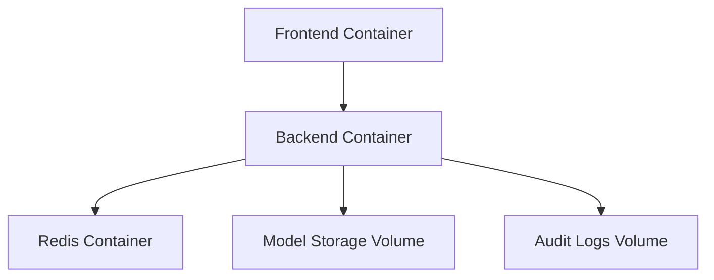

# DoctorAI Deployment Documentation

## Overview

The DoctorAI system is designed for production deployment using modern containerization and orchestration technologies. This document covers Docker-based deployment, infrastructure requirements, monitoring, scaling, and operational procedures for both development and production environments.

## Infrastructure Requirements

### System Requirements

#### Minimum Requirements
- **CPU**: 4 cores (2.0 GHz or higher)
- **RAM**: 6GB (8GB recommended for optimal performance)
- **Storage**: 15GB free disk space
- **Network**: Stable internet connection (minimum 10 Mbps)
- **OS**: Linux (Ubuntu 20.04+), macOS, or Windows 10/11

#### Recommended Production Requirements
- **CPU**: 8+ cores (3.0 GHz or higher)
- **RAM**: 16GB+ (32GB for high-load scenarios)
- **Storage**: 50GB+ SSD storage
- **Network**: High-speed connection (100+ Mbps)
- **OS**: Linux (Ubuntu 22.04 LTS recommended)

#### GPU Requirements (Optional)
- **GPU**: NVIDIA GPU with CUDA support
- **VRAM**: 8GB+ for optimal model performance
- **CUDA**: Version 11.8 or higher
- **cuDNN**: Compatible version for TensorFlow/PyTorch

### Software Dependencies

#### Required Software
- **Docker Engine**: 20.10+ with BuildKit support
- **Docker Compose**: 2.0+ with v3.8+ compose file support
- **Git**: Latest version for source code management
- **curl**: For health checks and API testing

#### Optional Development Tools
- **Node.js**: 18+ for frontend development
- **Python**: 3.9+ for backend development
- **Redis CLI**: For cache management and debugging

## Docker Architecture

### Container Services

#### Service Overview
```yaml
# Docker Compose Service Architecture
services:
  - frontend    # React application (Port: 5173)
  - backend     # FastAPI server (Port: 8000)
  - redis       # Cache & session storage (Port: 6379)
```

#### Service Dependencies


### Container Specifications

#### Frontend Container
```dockerfile
# Multi-stage build for optimized production image
FROM node:18-alpine AS builder
WORKDIR /app
COPY package*.json ./
RUN npm ci --only=production
COPY . .
RUN npm run build

FROM nginx:alpine AS production
COPY --from=builder /app/dist /usr/share/nginx/html
EXPOSE 4173
```

**Specifications:**
- **Base Image**: Node.js 18 Alpine (build), Nginx Alpine (runtime)
- **Port Mapping**: 5173:4173
- **Memory Limit**: 512MB
- **CPU Limit**: 1 core
- **Health Check**: HTTP GET to localhost:4173

#### Backend Container
```dockerfile
FROM python:3.9-slim AS production
WORKDIR /app
COPY requirements.txt .
RUN pip install --no-cache-dir -r requirements.txt
COPY . .
EXPOSE 8000
CMD ["python", "start_server.py"]
```

**Specifications:**
- **Base Image**: Python 3.9 Slim
- **Port Mapping**: 8000:8000
- **Memory Limit**: 6GB (for AI models)
- **CPU Limit**: 4 cores
- **Volume Mounts**: Models (read-only), logs (read-write)
- **Health Check**: Custom Python script validation

#### Redis Container
```dockerfile
FROM redis:7-alpine
```

**Specifications:**
- **Base Image**: Redis 7 Alpine
- **Port Mapping**: 6379:6379
- **Memory Limit**: 1GB
- **Persistence**: AOF (Append Only File)
- **Health Check**: Redis ping command

### Volume Management

#### Volume Configuration
```yaml
volumes:
  redis_data:
    driver: local
    driver_opts:
      type: none
      o: bind
      device: ./redis-data
  
  model_storage:
    driver: local
    driver_opts:
      type: none
      o: bind
      device: ./models
  
  audit_logs:
    driver: local
    driver_opts:
      type: none
      o: bind
      device: ./logs
```

#### Volume Types
- **Model Storage**: Read-only mount for AI model files (.h5, .pkl)
- **Redis Data**: Persistent storage for cache and session data
- **Audit Logs**: Write-enabled mount for security and operation logs
- **Configuration**: Environment-specific configuration files

### Network Configuration

#### Custom Network
```yaml
networks:
  app-network:
    driver: bridge
    ipam:
      config:
        - subnet: 172.20.0.0/16
```

#### Service Communication
- **Internal DNS**: Services communicate via service names
- **Port Isolation**: Only necessary ports exposed externally
- **Security Groups**: Network-level access control
- **Load Balancing**: Ready for multi-instance deployment

## Deployment Procedures

### Quick Start Deployment

#### One-Command Deployment
```bash
# Clone repository
git clone https://github.com/yourusername/DoctorAI-DEPI-AI-Web-Application.git
cd DoctorAI-DEPI-AI-Web-Application

# Start all services
docker-compose up -d

# Verify deployment
curl http://localhost:8000/api/health
curl http://localhost:5173
```

#### Environment Setup
```bash
# Copy environment template
cp .env.example .env

# Edit configuration
nano .env

# Set proper permissions
chmod 600 .env
chmod 755 models/
chmod 644 models/*.h5
```

### Development Deployment

#### Development Environment
```bash
# Start with hot reloading
docker-compose -f docker-compose.yml -f docker-compose.dev.yml up

# Development features:
# - Frontend hot reload via Vite HMR
# - Backend auto-reload with uvicorn --reload
# - Debug logging enabled
# - Development CORS settings
```

#### Development Override Configuration
```yaml
# docker-compose.dev.yml
version: '3.8'
services:
  backend:
    volumes:
      - ./backend:/app
    environment:
      - LOG_LEVEL=DEBUG
      - RELOAD=true
    command: ["uvicorn", "main:app", "--host", "0.0.0.0", "--port", "8000", "--reload"]
  
  frontend:
    volumes:
      - ./react-app:/app
    command: ["npm", "run", "dev", "--", "--host", "0.0.0.0"]
```

### Production Deployment

#### Production Configuration
```bash
# Build production images
docker-compose build --no-cache

# Start production services
docker-compose up -d

# Scale backend for high availability
docker-compose up -d --scale backend=3

# Enable log rotation
docker-compose exec backend logrotate /etc/logrotate.d/doctorai
```

#### Production Environment Variables
```env
# Security Configuration
SECRET_KEY=<secure-random-256-bit-key>
ACCESS_TOKEN_EXPIRE_MINUTES=30
CORS_ORIGINS=https://yourdomain.com

# Performance Configuration
REDIS_URL=redis://redis:6379
ENABLE_MODEL_CACHING=true
MAX_CONCURRENT_REQUESTS=100

# Monitoring Configuration
LOG_LEVEL=INFO
HEALTH_CHECK_INTERVAL=30
METRICS_ENABLED=true

# External Services
AZURE_STORAGE_CONNECTION_STRING=<azure-connection>
SENTRY_DSN=<error-tracking-dsn>
```

## Environment Configuration

### Environment Variables Reference

#### Backend Configuration
```env
# API Server Settings
API_HOST=0.0.0.0
API_PORT=8000
WORKERS=4
LOG_LEVEL=INFO

# Security Settings
SECRET_KEY=your_secure_256_bit_key
ACCESS_TOKEN_EXPIRE_MINUTES=30
CORS_ORIGINS=http://localhost:5173,https://yourdomain.com

# Model Configuration
MODEL_PATH=/app/models
ENABLE_MODEL_CACHING=true
MAX_IMAGE_SIZE=10485760  # 10MB
SUPPORTED_FORMATS=jpg,jpeg,png

# External Services
REDIS_URL=redis://redis:6379
AZURE_STORAGE_CONNECTION_STRING=optional_azure_connection

# AI/ML Settings
CHATBOT_USE_GPU=false
PYTORCH_AVAILABLE=true
TENSORFLOW_MEMORY_GROWTH=true

# Monitoring & Logging
HEALTH_CHECK_INTERVAL=30
AUDIT_LOG_RETENTION_DAYS=30
METRICS_COLLECTION_ENABLED=true
```

#### Frontend Configuration
```env
# API Configuration
VITE_API_URL=http://localhost:8000
VITE_API_TIMEOUT=30000

# Environment Settings
NODE_ENV=production
VITE_APP_NAME="DoctorAI"
VITE_APP_VERSION=2.0.0

# Feature Flags
VITE_ENABLE_ANALYTICS=false
VITE_ENABLE_DEBUG=false

# Performance Settings
VITE_BUNDLE_SIZE_LIMIT=2048  # KB
VITE_IMAGE_OPTIMIZATION=true
```

#### Redis Configuration
```env
# Redis Settings
REDIS_PASSWORD=optional_password
REDIS_DB=0
REDIS_MAX_CONNECTIONS=20

# Persistence Settings
REDIS_SAVE_INTERVAL=900  # seconds
REDIS_AOF_ENABLED=yes
REDIS_MAX_MEMORY=1gb
REDIS_MAX_MEMORY_POLICY=allkeys-lru
```

### Configuration Management

#### Environment-Specific Configs
```bash
# Environment hierarchy
.env.local       # Local development overrides
.env.development # Development environment
.env.staging     # Staging environment
.env.production  # Production environment
.env             # Default fallback
```

#### Secret Management
```bash
# Generate secure secret key
openssl rand -hex 32

# Store secrets securely
docker secret create doctorai_secret_key secret_key.txt
docker secret create doctorai_azure_conn azure_connection.txt

# Use secrets in compose
services:
  backend:
    secrets:
      - doctorai_secret_key
      - doctorai_azure_conn
```

## Health Monitoring & Checks

### Health Check Implementation

#### Backend Health Check
```python
# Custom health check endpoint
@app.get("/api/health")
async def health_check():
    health_status = {
        "status": "healthy",
        "timestamp": datetime.utcnow().isoformat(),
        "version": "2.0.0",
        "uptime": get_uptime(),
        "models": check_model_availability(),
        "dependencies": check_dependencies(),
        "system": get_system_metrics()
    }
    return health_status

def check_model_availability():
    return {
        "lung_colon": lung_colon_model is not None,
        "monkeypox": monkeypox_model is not None,
        "tumor": tumor_model is not None,
        "xray": xray_model is not None,
        "chatbot": chatbot_model is not None,
        "palm_disease": palm_disease_model is not None
    }
```

#### Container Health Checks
```yaml
# Docker Compose health check configuration
services:
  backend:
    healthcheck:
      test: ["CMD", "python", "test_server.py"]
      interval: 30s
      timeout: 10s
      retries: 3
      start_period: 60s
  
  frontend:
    healthcheck:
      test: ["CMD", "curl", "-f", "http://localhost:4173"]
      interval: 30s
      timeout: 10s
      retries: 3
  
  redis:
    healthcheck:
      test: ["CMD", "redis-cli", "ping"]
      interval: 10s
      timeout: 5s
      retries: 3
```

### Monitoring Stack

#### Metrics Collection
```yaml
# Prometheus monitoring configuration
services:
  prometheus:
    image: prom/prometheus:latest
    ports:
      - "9090:9090"
    volumes:
      - ./monitoring/prometheus.yml:/etc/prometheus/prometheus.yml
      - prometheus_data:/prometheus
  
  grafana:
    image: grafana/grafana:latest
    ports:
      - "3000:3000"
    environment:
      - GF_SECURITY_ADMIN_PASSWORD=admin
    volumes:
      - grafana_data:/var/lib/grafana
      - ./monitoring/grafana/dashboards:/var/lib/grafana/dashboards
```

#### Key Metrics Monitored
- **Application Metrics**: Response time, request rate, error rate
- **System Metrics**: CPU usage, memory consumption, disk I/O
- **Model Metrics**: Inference time, model accuracy, prediction confidence
- **Business Metrics**: User activity, model usage, success rates

#### Alerting Rules
```yaml
# Prometheus alerting rules
groups:
  - name: doctorai_alerts
    rules:
      - alert: HighResponseTime
        expr: http_request_duration_seconds{quantile="0.95"} > 1
        for: 5m
        labels:
          severity: warning
        annotations:
          summary: "High response time detected"
      
      - alert: ModelUnavailable
        expr: model_availability == 0
        for: 1m
        labels:
          severity: critical
        annotations:
          summary: "AI model is unavailable"
      
      - alert: HighMemoryUsage
        expr: memory_usage_percent > 85
        for: 5m
        labels:
          severity: warning
        annotations:
          summary: "High memory usage detected"
```

## Scaling & Load Balancing

### Horizontal Scaling

#### Backend Scaling
```bash
# Scale backend instances
docker-compose up -d --scale backend=5

# Load balancer configuration (Nginx)
upstream backend_servers {
    server backend:8000 weight=1;
    server backend:8000 weight=1;
    server backend:8000 weight=1;
    keepalive 32;
}

server {
    listen 80;
    location /api {
        proxy_pass http://backend_servers;
        proxy_set_header Host $host;
        proxy_set_header X-Real-IP $remote_addr;
        proxy_set_header X-Forwarded-For $proxy_add_x_forwarded_for;
    }
}
```

#### Database Scaling
```yaml
# Redis cluster configuration
services:
  redis-master:
    image: redis:7-alpine
    command: redis-server --port 6379
  
  redis-replica-1:
    image: redis:7-alpine
    command: redis-server --port 6379 --replicaof redis-master 6379
  
  redis-replica-2:
    image: redis:7-alpine
    command: redis-server --port 6379 --replicaof redis-master 6379
```

### Auto-Scaling Configuration

#### Docker Swarm Auto-Scaling
```bash
# Initialize Docker Swarm
docker swarm init

# Deploy as a stack
docker stack deploy -c docker-compose.swarm.yml doctorai

# Configure auto-scaling
docker service update --replicas 3 doctorai_backend
docker service update --limit-memory 2g doctorai_backend
```

#### Kubernetes Deployment
```yaml
# Kubernetes HPA configuration
apiVersion: autoscaling/v2
kind: HorizontalPodAutoscaler
metadata:
  name: doctorai-backend-hpa
spec:
  scaleTargetRef:
    apiVersion: apps/v1
    kind: Deployment
    name: doctorai-backend
  minReplicas: 2
  maxReplicas: 10
  metrics:
  - type: Resource
    resource:
      name: cpu
      target:
        type: Utilization
        averageUtilization: 70
  - type: Resource
    resource:
      name: memory
      target:
        type: Utilization
        averageUtilization: 80
```

## Security Hardening

### Container Security

#### Security Best Practices
```dockerfile
# Secure Dockerfile practices
FROM python:3.9-slim AS base

# Create non-root user
RUN groupadd -r doctorai && useradd -r -g doctorai doctorai

# Set security options
USER doctorai
WORKDIR /app

# Copy with proper ownership
COPY --chown=doctorai:doctorai . .

# Remove unnecessary packages
RUN apt-get autoremove -y && apt-get clean && rm -rf /var/lib/apt/lists/*

# Security labels
LABEL security.level="high"
LABEL security.scan="enabled"
```

#### Runtime Security
```yaml
# Docker Compose security configuration
services:
  backend:
    security_opt:
      - no-new-privileges:true
    read_only: true
    tmpfs:
      - /tmp:noexec,nosuid,size=1g
    cap_drop:
      - ALL
    cap_add:
      - NET_BIND_SERVICE
    user: "1000:1000"
```

### Network Security

#### Firewall Configuration
```bash
# UFW firewall rules
sudo ufw default deny incoming
sudo ufw default allow outgoing
sudo ufw allow 22/tcp    # SSH
sudo ufw allow 80/tcp    # HTTP
sudo ufw allow 443/tcp   # HTTPS
sudo ufw allow 8000/tcp  # API (restrict to specific IPs in production)
sudo ufw enable
```

#### SSL/TLS Configuration
```nginx
# Nginx SSL configuration
server {
    listen 443 ssl http2;
    server_name your-domain.com;
    
    ssl_certificate /etc/ssl/certs/your-domain.crt;
    ssl_certificate_key /etc/ssl/private/your-domain.key;
    
    ssl_protocols TLSv1.2 TLSv1.3;
    ssl_ciphers ECDHE-RSA-AES256-GCM-SHA384:ECDHE-RSA-AES128-GCM-SHA256;
    ssl_prefer_server_ciphers off;
    
    # Security headers
    add_header Strict-Transport-Security "max-age=31536000; includeSubDomains" always;
    add_header X-Frame-Options DENY always;
    add_header X-Content-Type-Options nosniff always;
    add_header Referrer-Policy strict-origin-when-cross-origin always;
}
```

## Backup & Recovery

### Data Backup Strategy

#### Automated Backup Scripts
```bash
#!/bin/bash
# backup_doctorai.sh

BACKUP_DIR="/backups/doctorai/$(date +%Y%m%d_%H%M%S)"
mkdir -p "$BACKUP_DIR"

# Backup Redis data
docker-compose exec redis redis-cli BGSAVE
docker cp $(docker-compose ps -q redis):/data/dump.rdb "$BACKUP_DIR/"

# Backup model files
tar -czf "$BACKUP_DIR/models.tar.gz" ./models/

# Backup configuration
cp .env "$BACKUP_DIR/"
cp docker-compose.yml "$BACKUP_DIR/"

# Backup logs
tar -czf "$BACKUP_DIR/logs.tar.gz" ./logs/

# Create checksums
cd "$BACKUP_DIR"
sha256sum * > checksums.sha256

echo "Backup completed: $BACKUP_DIR"
```

#### Backup Retention Policy
```bash
# Automated cleanup (keep 30 days)
find /backups/doctorai -type d -mtime +30 -exec rm -rf {} \;

# Weekly full backups
0 2 * * 0 /scripts/backup_doctorai.sh

# Daily incremental backups
0 2 * * 1-6 /scripts/backup_incremental.sh
```

### Disaster Recovery

#### Recovery Procedures
```bash
#!/bin/bash
# restore_doctorai.sh

BACKUP_PATH=$1
if [ -z "$BACKUP_PATH" ]; then
    echo "Usage: $0 <backup_path>"
    exit 1
fi

# Stop services
docker-compose down

# Restore Redis data
docker-compose up -d redis
sleep 10
docker cp "$BACKUP_PATH/dump.rdb" $(docker-compose ps -q redis):/data/
docker-compose restart redis

# Restore models
tar -xzf "$BACKUP_PATH/models.tar.gz" -C ./

# Restore configuration
cp "$BACKUP_PATH/.env" ./
cp "$BACKUP_PATH/docker-compose.yml" ./

# Start services
docker-compose up -d

echo "Recovery completed from: $BACKUP_PATH"
```

#### High Availability Setup
```yaml
# Multi-region deployment configuration
version: '3.8'
services:
  nginx-lb:
    image: nginx:alpine
    ports:
      - "80:80"
      - "443:443"
    volumes:
      - ./nginx/nginx.conf:/etc/nginx/nginx.conf
    depends_on:
      - backend-region-1
      - backend-region-2
  
  backend-region-1:
    build: ./backend
    environment:
      - REGION=us-east-1
      - REDIS_URL=redis://redis-primary:6379
  
  backend-region-2:
    build: ./backend
    environment:
      - REGION=us-west-1
      - REDIS_URL=redis://redis-replica:6379
```

## Troubleshooting

### Common Deployment Issues

#### Container Startup Issues
```bash
# Check container status
docker-compose ps

# View container logs
docker-compose logs backend
docker-compose logs frontend
docker-compose logs redis

# Debug container
docker-compose exec backend bash
docker-compose exec backend python test_server.py
```

#### Resource Issues
```bash
# Monitor resource usage
docker stats

# Check disk space
df -h
docker system df

# Clean up unused resources
docker system prune -a
docker volume prune
```

#### Model Loading Issues
```bash
# Verify model files
ls -la models/
file models/*.h5

# Check model integrity
docker-compose exec backend python -c "
import tensorflow as tf
try:
    model = tf.keras.models.load_model('/app/models/Model.h5')
    print('Model loaded successfully')
except Exception as e:
    print(f'Model loading failed: {e}')
"
```

### Performance Troubleshooting

#### Memory Optimization
```bash
# Increase Docker memory
# Docker Desktop > Settings > Resources > Memory: 8GB+

# Monitor memory usage
docker-compose exec backend python -c "
import psutil
print(f'Memory usage: {psutil.virtual_memory().percent}%')
print(f'Available memory: {psutil.virtual_memory().available / 1024**3:.1f}GB')
"
```

#### Network Debugging
```bash
# Test network connectivity
docker-compose exec frontend curl http://backend:8000/api/health
docker-compose exec backend redis-cli -h redis ping

# Check port bindings
netstat -tulpn | grep -E ':(5173|8000|6379)'
```

This deployment documentation provides comprehensive guidance for deploying, monitoring, and maintaining the DoctorAI system in both development and production environments. 