# DoctorAI: Complete Technical Documentation

> **AI-Powered Medical Diagnosis System**  
> **Version**: 2.0.0 | **Last Updated**: December 2024  
> **DEPI AI Web Application Project**

## 📚 Documentation Index

This documentation provides comprehensive technical coverage of the DoctorAI system - an advanced AI-powered medical diagnosis platform with 6 specialized machine learning models, production-ready infrastructure, and enterprise-grade security.

### 📖 Documentation Structure

| Document | Description | Target Audience |
|----------|-------------|-----------------|
| **[🖥️ Frontend](./frontend.md)** | React + TypeScript web application architecture | Frontend Developers, UI/UX Teams |
| **[⚙️ Backend](./backend.md)** | FastAPI server, AI model integration, APIs | Backend Developers, DevOps Teams |
| **[🤖 AI Models](./ai_models.md)** | Machine learning models, architectures, performance | ML Engineers, Data Scientists |
| **[🚀 Deployment](./deployment.md)** | Docker deployment, infrastructure, monitoring | DevOps Engineers, System Administrators |
| **[🏗️ Architecture](./architecture.md)** | System architecture, design patterns, scalability | Architects, Technical Leads |

---

## 🎯 Project Overview

### Current System Status
- **✅ 3/6 AI Models Deployed**: Lung/Colon Cancer, Monkeypox Detection, Brain Tumor Analysis
- **🚧 3 Models Under Deployment**: X-ray Analysis, Medical Chatbot, Palm Disease Detection
- **🔧 Full-Stack Application**: React frontend + FastAPI backend
- **🐳 Production Infrastructure**: Docker containerization with health monitoring
- **🔐 Enterprise Security**: JWT authentication, audit logging, multi-layer security

### Technology Stack
```
Frontend:  React 18 + TypeScript + Tailwind CSS + Redux Toolkit
Backend:   FastAPI + Python 3.9 + TensorFlow 2.17 + PyTorch
AI/ML:     DenseNet201, Custom CNNs, T5 Transformers, XGBoost
Infra:     Docker + Redis + Nginx + Health Monitoring
Security:  JWT + bcrypt + CORS + Rate Limiting + Audit Logs
```

### Performance Metrics
- **Response Time**: 150-300ms for AI model inference
- **Model Accuracy**: 94-99% across deployed models  
- **System Memory**: 4-6GB total (1.1-1.3GB per .h5 model)
- **Availability**: 99.5% uptime target with auto-restart
- **Throughput**: 8-50 predictions/second per model

---

## 🏥 Medical AI Models Portfolio

### ✅ Currently Deployed Models

| Model | Accuracy | Size | Use Case | Status |
|-------|----------|------|----------|--------|
| **🫁 Lung/Colon Cancer** | 95%+ | 85MB | Histopathology Analysis | ✅ Production |
| **🐒 Monkeypox Detection** | 98-99% | 92MB | Skin Lesion Classification | ✅ Production |
| **🧠 Brain Tumor Analysis** | 94%+ | 78MB | MRI Scan Interpretation | ✅ Production |

### 🚧 Under Deployment

| Model | Expected Accuracy | Size | Use Case | Status |
|-------|------------------|------|----------|--------|
| **📱 X-ray Analysis** | 92%+ | 65MB | Pneumonia Detection | 🚧 Integration |
| **💬 Medical Chatbot** | NLP | 98MB | Arabic/English Q&A | 🚧 Quality Testing |
| **🔬 Palm Disease** | 89%+ | 2MB | Anemia Detection | 🚧 Deployment |

---

## 🚀 Quick Start Guide
## 📸 Application Screenshots

### 🏠 Home Interface

*Home Guide*

### 🏠 Home Interface

*Modern UI design & supporting dark themes*


*Supporting Dark Themes*

### 🏠 Home Interface

*Supporting Arabic Language*


*DoctorAI Features*


*Trusted Tools*

### 🏠 Home Interface

*AI-powered website*


*Medical Diagnostics*

### 🔬 Advanced Diagnostics

*Monkeypox image analysis with AI-powered diagnostic insights*


*Palm disease and anemia detection using XGBoost machine learning*

### 📊 Results & Reports

*Comprehensive diagnostic results with confidence scores and recommendations*


*Detailed analysis summary with medical insights and next steps*


*System health monitoring and performance metrics dashboard*

### Prerequisites
- **Docker Engine** 20.10+ and **Docker Compose** 2.0+
- **6GB+ RAM** (8GB recommended for optimal performance)
- **15GB+ Storage** (for large .h5 model files)
- **Internet Connection** for initial setup

### One-Command Deployment
```bash
# Clone repository
git clone <repository-url>
cd DoctorAI-DEPI-AI-Web-Application

# Deploy entire system
docker-compose up -d

# Verify deployment
curl http://localhost:8000/api/health    # Backend API
curl http://localhost:5173              # Frontend App
```

### Access Points
- **🌐 Web Application**: http://localhost:5173
- **📚 API Documentation**: http://localhost:8000/docs  
- **⚡ Health Check**: http://localhost:8000/api/health
- **📊 API Endpoints**: http://localhost:8000/redoc

---

## 📐 System Architecture Overview

### High-Level Architecture

```mermaid
graph TB
    A["🌐 React Web<br/>TypeScript<br/>Port: 5173"] --> B["⚙️ FastAPI<br/>Python<br/>Port: 8000"]
    B --> C["📦 Redis<br/>Cache<br/>Port: 6379"]
    A --> D["🤖 AI Models<br/>6 Models<br/>TF + PyTorch<br/>85-98MB each"]
    B --> D
    C --> D
    
    classDef frontend fill:#61dafb,stroke:#21a1c4,stroke-width:2px,color:#000
    classDef backend fill:#009688,stroke:#00695c,stroke-width:2px,color:#fff
    classDef cache fill:#dc382d,stroke:#a82c21,stroke-width:2px,color:#fff
    classDef ai fill:#ff9800,stroke:#e65100,stroke-width:2px,color:#fff
    
    class A frontend
    class B backend
    class C cache
    class D ai
```


### Component Responsibilities
- **Frontend**: User interface, image upload, results visualization
- **Backend**: API endpoints, model management, authentication, caching
- **AI Models**: Medical image analysis, text processing, prediction generation
- **Redis**: Session management, result caching, performance optimization
- **Docker**: Container orchestration, health monitoring, auto-restart

---

## 🔐 Security & Compliance

### Multi-Layer Security
```
Layer 1: Network Security (SSL/TLS, Firewall, VPN)
Layer 2: Application Security (CORS, Rate Limiting, Input Validation)
Layer 3: Authentication (JWT Tokens, bcrypt Hashing)
Layer 4: Authorization (RBAC, Resource Permissions)
Layer 5: Data Security (Encryption, PII Protection)
Layer 6: Audit & Compliance (Logging, Monitoring, Reporting)
```

### Medical Compliance
- **⚠️ Educational Use Only**: Not approved for clinical diagnosis
- **🔒 No Personal Data Storage**: Images processed in memory only
- **📋 Medical Disclaimers**: Professional consultation recommendations
- **📊 Audit Trails**: Comprehensive security event logging
- **🛡️ Privacy Protection**: GDPR/HIPAA compliance considerations

---

## 📊 Performance & Monitoring

### Real-Time Metrics
- **System Health**: Container status, service availability
- **Model Performance**: Inference time, memory usage, accuracy
- **API Metrics**: Response time, error rate, throughput
- **Resource Usage**: CPU, memory, disk I/O monitoring

### Monitoring Stack
```bash
# Health checks
docker-compose ps                    # Container status
curl http://localhost:8000/api/health # System health

# Performance monitoring  
docker stats                        # Resource usage
docker-compose logs -f backend       # Application logs
```

---

## 🛠️ Development & Maintenance

### Development Workflow
```bash
# Development environment with hot reloading
docker-compose -f docker-compose.yml -f docker-compose.dev.yml up

# Backend development
cd backend && python start_server.py

# Frontend development  
cd react-app && npm run dev

# Testing
python test_server.py               # Backend tests
npm test                           # Frontend tests
```

### Model Management
- **Lazy Loading**: Models loaded on first request
- **Memory Optimization**: Efficient caching and cleanup
- **Error Handling**: Graceful degradation on model failures
- **Health Monitoring**: Real-time model availability tracking

---

## 🌟 Key Achievements

### Technical Excellence
- **🎯 High Accuracy**: 98-99% accuracy on monkeypox detection
- **⚡ Fast Performance**: Sub-second inference times
- **🔧 Production Ready**: Enterprise-grade infrastructure
- **📈 Scalable Design**: Horizontal scaling capabilities
- **🛡️ Secure by Design**: Comprehensive security implementation

### Innovation Highlights
- **🔬 Medical AI**: Specialized models for different medical conditions
- **🌍 Multilingual**: Arabic/English medical chatbot support
- **📱 Modern UI**: Responsive design with accessibility features
- **🐳 DevOps**: Full containerization with monitoring
- **📊 Analytics**: Comprehensive metrics and health monitoring

---

## 🚧 Future Roadmap

### Version 2.1.0 (Q1 2025)
- [ ] Complete deployment of remaining 3 models
- [ ] Enhanced UI/UX with better visualizations  
- [ ] Mobile application development
- [ ] Advanced analytics dashboard

### Version 3.0.0 (Q2 2025)
- [ ] Microservices architecture decomposition
- [ ] DICOM image format support
- [ ] Integration with hospital systems (HL7 FHIR)
- [ ] Multi-tenant architecture
- [ ] Compliance with medical device regulations

---

## 👥 Development Team

**🎯 Project Lead**: Mostafa Abdo - Full-Stack Development & Infrastructure  
**🤖 AI/ML Team**: Menna Ateya, Adel Mahmoud, Yousef Alaa, Mohamed Osama, Mohamed Ahmed Talba  
**🎓 Program**: DEPI AI - Digital Egypt Pioneers Initiative  
**📅 Timeline**: 6 months development, 3 weeks for mega project delivery  

---

## 📞 Support & Resources

### Documentation Access
- **📖 Technical Docs**: See individual component documentation files
- **🔗 API Reference**: http://localhost:8000/docs (when running)
- **🧪 Testing Guides**: Included in backend and AI models documentation
- **🚀 Deployment Guide**: Comprehensive infrastructure setup instructions

### Contact Information
- **📧 Technical Support**: mostafaabdohelgohary@gmail.com
- **🐛 Bug Reports**: GitHub Issues (project repository)
- **💬 General Inquiries**: mostafaabdohelgohary@gmail.com

---

## ⚖️ License & Disclaimer

### Software License
This project is licensed under the **MIT License** - see LICENSE file for details.

### Medical Disclaimer
**⚠️ IMPORTANT**: This application is for **educational and research purposes only**. It should **never** be used as a substitute for professional medical advice, diagnosis, or treatment. Always consult qualified healthcare professionals for medical concerns.

---

**🩺 Built with ❤️ for better healthcare through AI innovation 🩺**

*Complete Technical Documentation | DoctorAI v2.0.0 | December 2024* 
